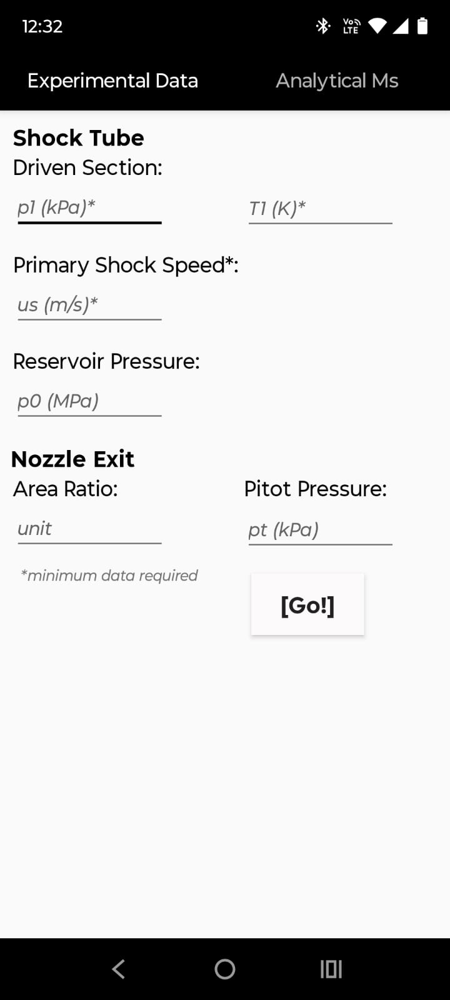
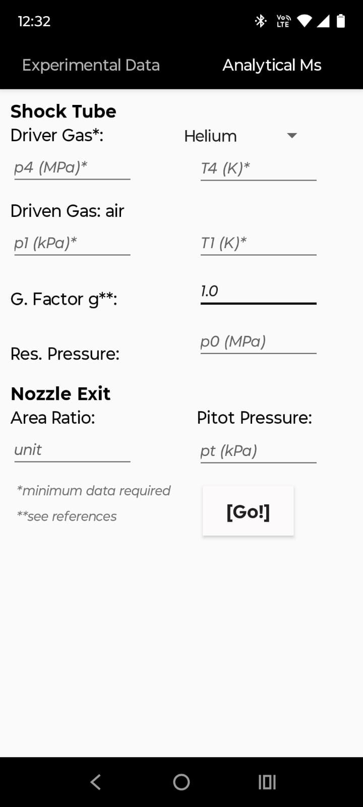
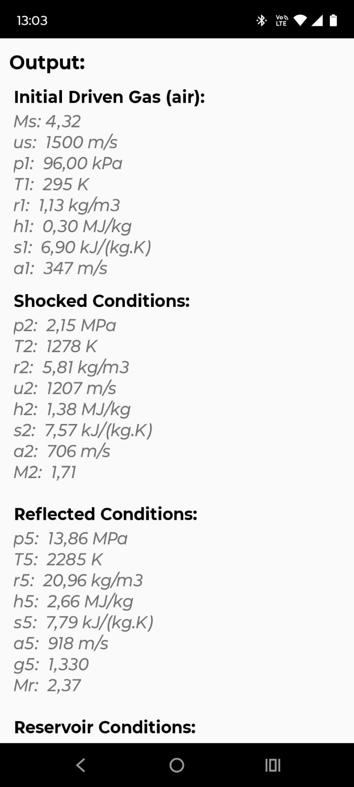
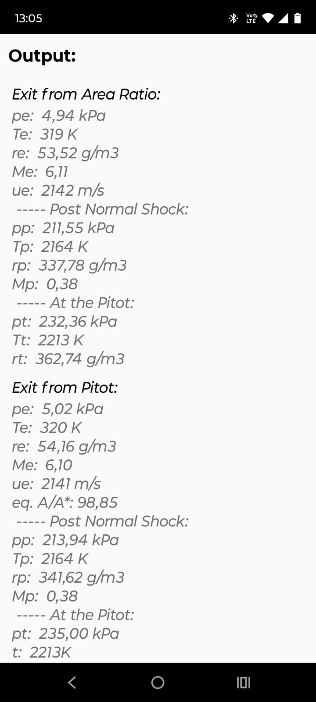

# Summary

Shock tubes and shock tunnels are experimental facilities used to study high-speed gas dynamics, simulating extreme flow conditions relevant to aerospace, defense, and fundamental fluid mechanics research. Characterizing these facilities is a critical step in high-speed flow studies, yet traditional methods often require complex calculations and specialized software. This project introduces a mobile application that streamlines this process, providing a simplified, fast, user-friendly solution for researchers, students, and engineers. By enabling real-time characterization directly on a mobile device, the app enhances accessibility and accelerates experimental diagnostics. Its intuitive interface and instant results facilitate rapid decision-making, making it a valuable tool for both academic and applied research in aerodynamics.

# Statement of need

Shock tube and tunnel experiments, essential in the study of supersonic flows, require accurate calculations of shock wave conditions and free-stream properties. Traditional methods for characterizing these experiments frequently assume ideal gas behavior, which may not be accurate under high-pressure, high-temperature conditions. While more advanced models for real gas effects exist, they often require specialized software and significant computational resources.

Some approaches exist for modeling real gas behavior at the high temperatures encountered in high-enthalpy shock tunnels, such as the programs in @minucci93, @wisl2025, @morley07, @mcbride1992computer. However, these methods often rely on computational codes that are not widely accessible or user-friendly and require a dedicated computer, limiting their usability in field applications.

The STT Calc, a shock tube and tunnel calculator, addresses these issues by providing a mobile, user-friendly tool for rapid characterization of shock tube and tunnel experiments. The app estimates shocked and reflected conditions based on initial gas properties and shock wave speed, incorporating real air equilibrium effects. It also computes free-stream parameters using either the throat-to-exit area ratio or measured Pitot pressure, assuming isentropic, non-reactive flow. This enables accurate real gas modeling while ensuring accessibility in experimental settings.

Based on the initial pressure and temperature of the test gas, as well as the measured or estimated incident shock wave velocity, the app calculates the shocked and reflected gas conditions using the conservation equations of mass, energy, and momentum, known as the Rankine-Hugoniot relations [@anderson2021]. To achieve this, it employs an iterative procedure to determine the post-shock gas density using equations of state for air in thermodynamic equilibrium, as documented in [@srini87]. A Java implementation of these equations is also available in [@java2025].

In addition to post-shock calculations, the application estimates free-stream conditions at the nozzle exit, assuming an isentropic expansion. The user can provide either the nozzle area ratio or the Pitot pressure measurement, allowing the app to compute parameters such as pressure, temperature, and Mach number at the nozzle exit.

The incident shock wave velocity can be directly input based on experimental data provided by the user or estimated from the driver gas conditions, incorporating an empirical correction factor. This allows the app to support both the analysis of completed tests and the prediction of expected conditions for future experiments.

With a simple and efficient interface, the STT Calc quickly provides essential information for interpreting shock tunnel experiments, facilitating both analysis and test planning.

# Pipeline

**Data Input**

The app operates based on two approaches:

- **Post-Experiment Approach**: The user provides the driven (or test) gas conditions such as pressure (p1), temperature (T1) and the primary shock speed (us), as follows:

  {height="300pt"}
- **Pre-Experiment Approach**: The user provides the pressure and temperature data from the driver and driven sections of the shock tube (p1, T1, p1, p4) and the primary shock speed (us) is estimated based on theoretical asumptions, as seen below.

  {height="300pt"}

**Data Output**

1. **Shocked and Reflected Conditions**:

- Using the shock velocity, the app calculates the following parameters:
  - pressure, temperature, density, specific enthalpy, specific entropy and velocity, as follows:

    {height="300pt"}

   2. **Free-Stream Flow (If a Nozzle is Present)**:

- If the test facility includes a **nozzle**, the user can input the area ratio **A/A*** or a measured Pitot pressure. The app then calculates the free-stream flow, determining the Mach number and other related variables, as follows:

  {height="300pt"}

# Acknowledgements

The authors gratefully acknowledge the PROPHIPER program for its financial support and contribution to advancing hypersonic research and capabilities in Brazil. The authors would also like to thank the researchers and technicians from the Aerothermodynamics and Hypersonics Division for their support and assistance.

# References
